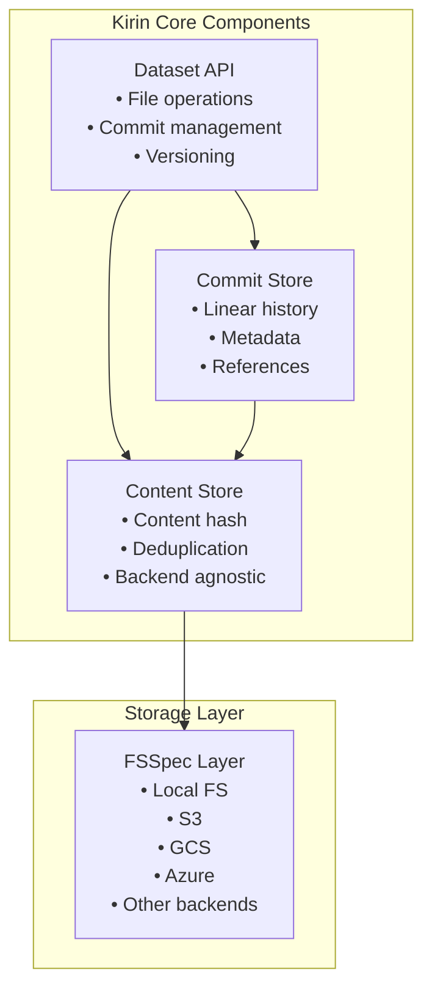
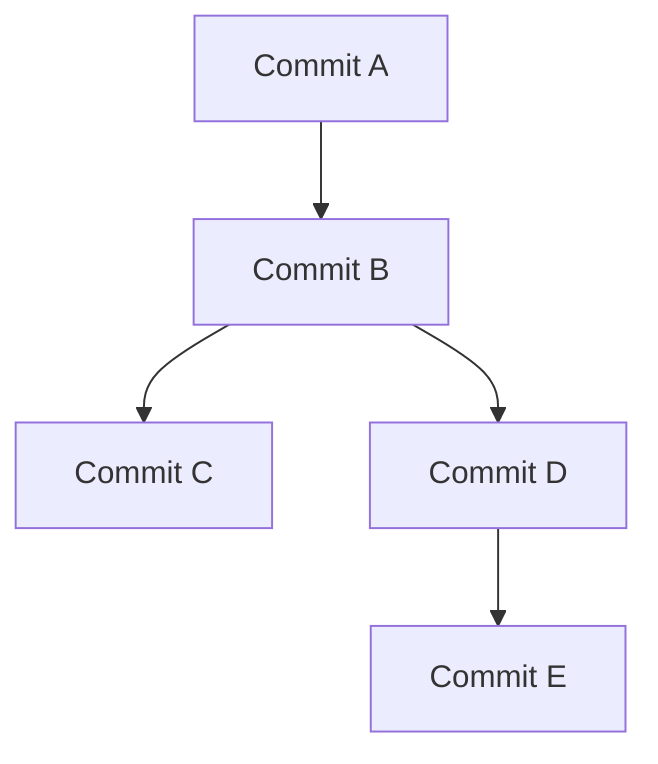
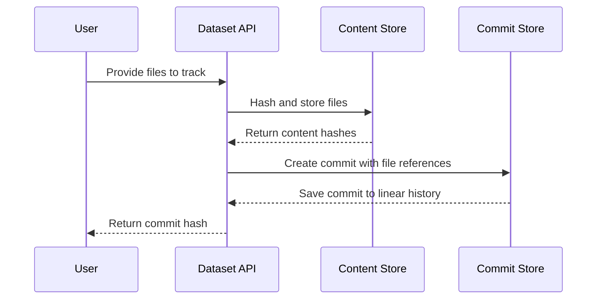
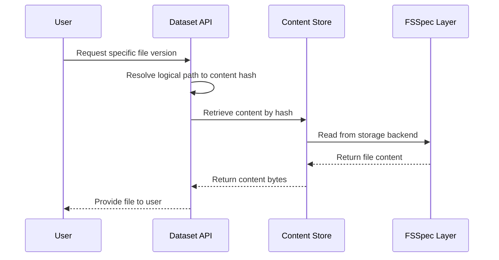

# Architecture Overview

High-level system architecture and design principles for Kirin.

## System Architecture

Kirin implements a simplified content-addressed storage system with the following
key components:

## Core Design Principles

### 1. Simplified Data Versioning

Kirin is simplified "git" for data - follows git conventions but with linear-only history:

- **Linear Commits**: Simple, linear commit history without branching complexity
- **Content-Addressed Storage**: Files stored by content hash for integrity and deduplication
- **Ergonomic Python API**: Focus on ease of use and developer experience
- **Backend-Agnostic**: Works with any storage backend via fsspec
- **No Branching**: Linear-only commit history to avoid complexity

### 2. Content-Addressed Storage Design

**CRITICAL**: Files are stored **without file extensions** in the content-addressed storage system:

- **Storage Path**: `root_dir/data/{hash[:2]}/{hash[2:]}` (e.g., `data/ab/cdef1234...`)
- **No Extensions**: Original `.csv`, `.txt`, `.json` extensions are not preserved in storage
- **Metadata Storage**: File extensions are stored as metadata in the `File` entity's `name` attribute
- **Extension Restoration**: When files are downloaded or accessed, they get their original names back
- **Content Integrity**: Files are identified purely by content hash, ensuring data integrity
- **Deduplication**: Identical content (regardless of original filename) is stored only once

### 3. File Access Patterns

Kirin provides simple file access through standard Python file operations:

- **Temporary file downloads**: Files are downloaded to temporary locations when accessed
- **Standard file handles**: Files are accessed through normal Python file objects
- **Automatic cleanup**: Temporary files are automatically cleaned up when file handles are closed
- **Streaming support**: Large files can be streamed through fsspec backends for efficient transfer

## Key Benefits

### For Data Scientists

- **Linear Data Versioning**: Track changes to datasets with simple, linear commits
- **Content-Addressed Storage**: Ensure data integrity and enable deduplication
- **Multi-Backend Support**: Work with S3, GCS, Azure, local filesystem, and more
- **Serverless Architecture**: No dedicated servers required
- **Ergonomic Python API**: Focus on ease of use and developer experience
- **File Versioning**: Track changes to individual files over time

### For Data Engineers

- **Backend-agnostic**: Works with any storage backend via fsspec
- **Automatic deduplication**: Identical files stored once, saving space
- **Content integrity**: Files stored by content hash for data integrity
- **Performance optimized**: Chunked processing for large files
- **Extensible**: Easy to add new backends and features

## User Personas and Jobs to be Done

### Data Scientist / ML Engineer

**Jobs to be Done:**

1. **Track Experiment Data**: "I need to keep track of which datasets were used in which experiments so I can reproduce my results."
2. **Find and Use the Right Data Version**: "I need to identify and access specific versions of datasets for training models."
3. **Collaborate with Team Members**: "I need to share datasets with colleagues in a way that ensures we're all using the same exact data."
4. **Document Data Transformations**: "I need to track how raw data is transformed into model-ready data."

### Data Engineer

**Jobs to be Done:**

1. **Manage Data Pipelines**: "I need to ensure data pipelines produce consistent, traceable outputs."
2. **Optimize Storage Usage**: "I need to handle large datasets efficiently without wasting storage."
3. **Support Multiple Storage Solutions**: "I need to work with data across various storage systems our organization uses."
4. **Ensure Data Governance**: "I need to track who accesses what data and how it's used."

### Data Team Manager / Lead

**Jobs to be Done:**

1. **Ensure Reproducibility**: "I need to guarantee that our team's work is reproducible for scientific integrity and audit purposes."
2. **Manage Technical Debt**: "I need to understand data dependencies to prevent cascading failures when data changes."
3. **Accelerate Onboarding**: "I need new team members to quickly understand our data ecosystem."
4. **Support Regulatory Compliance**: "I need to demonstrate data provenance for regulatory compliance."

### MLOps Engineer

**Jobs to be Done:**

1. **Deploy Models with Data Dependencies**: "I need to package models with their exact data dependencies."
2. **Monitor Data Drift**: "I need to compare production data against training data to detect drift."
3. **Implement Data-Centric CI/CD**: "I need automated tests that verify data quality across pipeline stages."
4. **Roll Back Data When Needed**: "I need to quickly revert to previous data versions if issues arise."

## Feature-to-Job Mapping

| Kirin Feature | Primary Jobs Addressed | Key User Personas |
|---------------|------------------------|-------------------|
| **Content-Addressed Storage** | • Track Experiment Data • Find and Use the Right Data Version • Collaborate with Team Members • Ensure Reproducibility • Ensure Experimental Reproducibility | Data Scientist, ML Engineer, Team Lead, Laboratory Scientist |
| **Automatic Lineage Tracking** | • Document Data Transformations • Manage Data Pipelines • Track Sample Lineage • Manage Technical Debt | Data Scientist, Data Engineer, Laboratory Scientist |
| **Backend-Agnostic Storage** | • Support Multiple Storage Solutions • Optimize Storage Usage • Manage Collaborative Research | Data Engineer, MLOps Engineer, Laboratory Scientist |
| **Dataset Versioning** | • Deploy Models with Data Dependencies • Roll Back Data When Needed • Monitor Data Drift • Ensure Experimental Reproducibility | MLOps Engineer, Data Engineer, Laboratory Scientist |
| **Usage Tracking** | • Document Data Usage • Ensure Data Governance • Support Regulatory Compliance • Document Methods and Parameters | Team Lead, Laboratory Scientist |
| **Streaming File Access** | • Optimize Storage Usage • Handle Large Datasets | Data Engineer, MLOps Engineer |
| **Data Catalog** | • Accelerate Onboarding • Find the Right Data Version • Manage Collaborative Research | Team Lead, Data Scientist, Laboratory Scientist |
| **Path-Based API** | • Implement Data-Centric CI/CD • Manage Data Pipelines | MLOps Engineer, Data Engineer |

## System Flow

### 1. Data Ingestion Flow

1. **User provides files** to be tracked
2. **Files are hashed** and stored in content store
3. **A commit is created** with references to file versions
4. **The commit is recorded** in the linear history

### 2. Data Access Flow

1. **User requests** a specific version of a file or dataset
2. **System resolves** the logical path to a content hash
3. **Content is retrieved** from the storage backend
4. **Content is provided** to the user

### 3. Data Processing Flow

1. **User accesses** input data files
2. **Processing is performed** on the data
3. **Output files are stored** in Kirin
4. **New commit is created** with updated files

## Linear vs. Branching

Kirin uses **linear commit history** instead of Git's branching model:

**Linear History (Kirin):**

**Branching History (Git):**

**Benefits of Linear History:**
- **Simpler**: No merge conflicts or complex branching
- **Clearer**: Easy to understand data evolution
- **Safer**: No risk of losing data through complex merges
- **Faster**: No need to resolve merge conflicts

## Backend-Agnostic Design

Kirin works with any storage backend through the fsspec library:

**Supported Backends:**
- **Local filesystem**: `/path/to/data`
- **AWS S3**: `s3://bucket/path`
- **Google Cloud Storage**: `gs://bucket/path`
- **Azure Blob Storage**: `az://container/path`
- **S3-compatible services**: Minio, Backblaze B2, DigitalOcean Spaces, Wasabi
- **And many more**: Dropbox, Google Drive, etc. (sync/auth handled by backend)

**Benefits:**
- **Flexibility**: Use any storage backend
- **Scalability**: Scale from local to cloud
- **Portability**: Move between backends easily
- **Cost optimization**: Choose the right storage for your needs

## System Flow Diagrams

### Data Ingestion Flow

### Data Access Flow

## Next Steps

- **[API Reference](../reference/api.md)** - Complete API documentation
- **[Storage Format](../reference/storage-format.md)** - Technical storage details
